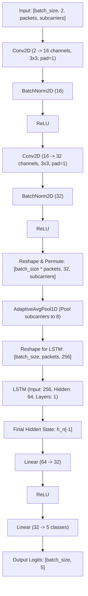

# SIH26

The Individual repo for SIH Internal Hackathon 2026

Created on 23rd August, Abisheak Saravanan.

# Wi-Fi Object Sensing

This project explores the possibility of using Wi-Fi signals to detect and understand the presence, movement, and basic structure of objects.

The goal is to investigate whether Wi-Fi can be used for sensing in a way similar to sonar or radar, with potential applications in object detection, indoor monitoring, and wireless environmental awareness.

This project is currently in the early exploration and development stage.

# Working Model Diagram

## Machine Learning Model Details

The system utilizes a hybrid Convolutional Neural Network and Long Short-Term Memory (CNN-LSTM) network specifically designed to classify patient activities and detect falls by analyzing multi-path Wi-Fi Channel State Information (CSI) signals (amplitude and phase) over time.

### 1. Network Architecture

The architecture is implemented in [model.py](file:///home/optimus/ml-model/model.py) as `CSIClassifier`. It uses a 2D CNN frontend to extract spatial-spectral characteristics from each Wi-Fi packet, followed by an LSTM backend to capture temporal dependencies and transitions across consecutive packets.

#### Layer Breakdown
* **Input Layer**: Shape `[batch_size, 2, packets, subcarriers]`. The 2 channels represent **Amplitude** (Channel 0) and **Phase** (Channel 1).
* **Convolutional Frontend**: Two successive 2D CNN layers (`Conv2D -> BatchNorm2D -> ReLU`) with $3\times3$ kernels and $1\times1$ padding capture localized patterns in the temporal-frequency domain.
* **Temporal Subcarrier Pooling**: The feature maps are permuted and reshaped to isolate the subcarrier dimension per packet. An `AdaptiveAvgPool1d` compresses the subcarriers to a fixed size of `8` while keeping the `packets` (temporal) dimension dynamic. This produces a sequence of packet features of shape `[batch_size, packets, 256]`.
* **LSTM Backend**: A recurrent LSTM layer processes the dynamic sequence of packet features step-by-step, allowing the network to capture temporal patterns like sequential movement and transient energy changes.
* **Classifier**: Feeds the final hidden state of the LSTM (`64` features) into a 32-node fully connected layer, which then outputs raw logits for the 5 target classes.

---

### 2. Preprocessing & Training Parameters

The model training pipeline is defined in [train.py](file:///home/optimus/ml-model/train.py):

* **Loss Function**: Cross-Entropy Loss (`nn.CrossEntropyLoss`).
* **Optimizer**: Adam (`lr = 0.001`).
* **Noise Injection (Regularization)**: During the training loop, standard Gaussian noise ($\sigma = 0.3$) is added to the input tensors to simulate environmental multipath interference, physical clutter changes, and electronic noise.
* **Dataset Rescaling**: Linear interpolation is applied dynamically in [dataset.py](file:///home/optimus/ml-model/dataset.py) to map varying subcarrier inputs to a standardized length of `114` subcarriers.

---

### 3. ONNX Model Specifications

The PyTorch model is compiled into ONNX format with dynamic axis configurations for scalable deployment:

* **Model File**: `csi_model.onnx` (Opset 18)
* **Input Tensor (`input`)**: `[batch_size, 2, packets, subcarriers]` (Float32)
* **Output Tensor (`output`)**: `[batch_size, 5]` (Float32 class logits)

#### Target Classification Classes
1. `Standing` (Index 0) - Stationary upright posture.
2. `Sitting` (Index 1) - Stationary seated posture.
3. `Walking` (Index 2) - Rhythmic low-frequency fluctuations (~1.5 Hz).
4. `Running` (Index 3) - High-frequency, high-amplitude fluctuations.
5. `Falling` (Index 4) - Sharp transient energy spike followed by near-zero variance.

*For full layer metadata and runtime inference integration code examples, see [onnx_details.md](./onnx_details.md).*
